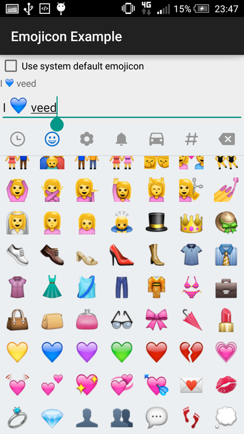

## Android Emojis

## Example

```xml
<LinearLayout xmlns:android="http://schemas.android.com/apk/res/android"
              xmlns:emojicon="http://schemas.android.com/apk/res-auto"
              android:layout_width="match_parent"
              android:layout_height="match_parent"
              android:orientation="vertical">

    <com.rockerhieu.emojicon.EmojiconTextView
            android:id="@+id/txtEmojicon"
            android:text="I \ue32d emojicon"
            emojicon:emojiconAlignment="baseline"
            android:layout_width="match_parent"
            android:layout_height="wrap_content"/>

    <com.rockerhieu.emojicon.EmojiconEditText
            android:id="@+id/editEmojicon"
            android:text="I \ue32d emojicon"
            emojicon:emojiconSize="28sp"
            android:layout_width="match_parent"
            android:layout_height="wrap_content"/>
    <fragment
            android:id="@+id/emojicons"
            android:layout_width="match_parent"
            android:layout_height="220dp"
            class="com.rockerhieu.emojicon.EmojiconsFragment"/>
</LinearLayout>
```



_Note: You can change the size and alignment of emojis in XML layout through attribute `emojiconSize` and `emojiconAlignment`, respectively._

## Usage

* `EmojiconTextView`: a `TextView` which can render emojis.
* `EmojiconEditText`: a `EditText` which can render emojis.
* `EmojiconMultiAutoCompleteTextView`: a `MultiAutoCompleteTextView` which can render emojis.
* `EmojiconGridFragment`: a fragment contains emojis in a `GridView` for the user to choose.
* `EmojiconsFragment`: a fragment contains many set of emojis for the user to choose.


## Acknowledgements

Emojicon is using emojis graphics from [emoji-cheat-sheet.com](https://github.com/arvida/emoji-cheat-sheet.com/tree/master/public/graphics/emojis).

## Credits
Based on this [repository](http://rockerhieu.github.io/emojicon/).

from Hieu Rocker (started 2014).

## License

* [Apache Version 2.0](http://www.apache.org/licenses/LICENSE-2.0.html)

```
Licensed under the Apache License, Version 2.0 (the "License");
you may not use this file except in compliance with the License.
You may obtain a copy of the License at

 http://www.apache.org/licenses/LICENSE-2.0

Unless required by applicable law or agreed to in writing, software
distributed under the License is distributed on an "AS IS" BASIS,
WITHOUT WARRANTIES OR CONDITIONS OF ANY KIND, either express or implied.
See the License for the specific language governing permissions and
limitations under the License.
```
